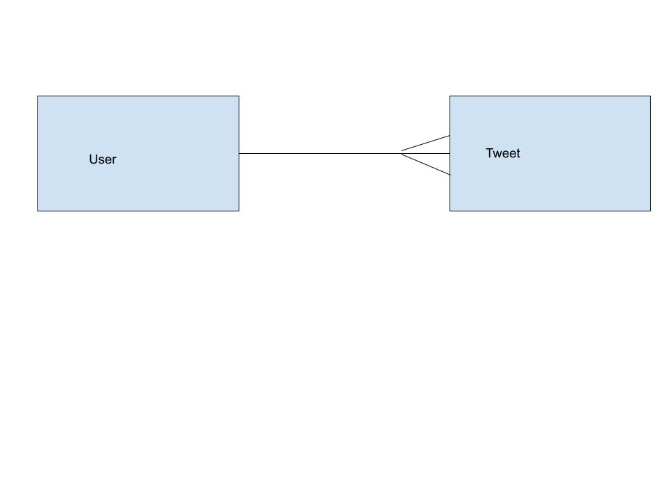

## One to Many Relationships
---

### SWBATs:

* REVIEW
* Implement one object to many objects relationship
  * One object _has many_ objects
  * One object _belongs to_ another object
* Demonstrate the concept of an Entity Relationship Diagram (ERD, domain model)
* Practice passing custom objects as arguments to methods
* Demonstrate Single Source of Truth
* Infer type of method (class or instance) through naming conventions

### Review

 Quick review of OOP: 
 <!-- let's take a poll -->
  * we created classes
  * we created instances of classes using `initialize`
  * we created instance and class methods

  <!-- let's list the macros -->
  * we used `attr_` macros for getters and setters
  - `attr_reader` (getter method/ read the value of the instance variable)
  - `attr_writer` (setter method/ change/set/update the value of the instance variable)
  - `attr_accessor` (combine attr_reader and attr_writer)

  <!-- * let's define self -->
  * we looked at `self` 
  - refers to the new instance object which was created (sometimes)
  - can be different depending on the context in which it is used (instance vs class levels)
  - the instance object which a method is run on is self 
  - used at the class level (create class methods)

  * types of variables
  - local variable (no special characters attached)
  - instance variable (@)
  - class variable (@@)

### Questions
- `attr_` macros: why reader and not accessor
  - `attr_reader`: allows us to read/see data and not to change it
  - `attr_accessor`: allows us to read/see data and to change it
  - `attr_reader :hero_name` -> this is actually a method! `attr_reader(:hero_name, :power)`
- explicit vs implicit `self` 
  - `self` -> subject of the sentence OR what a method is called on OR whose attributes are gonna matter within a method OR "object of the class" (if it's Superhero -> it's the new Superhero)
    - Maybe methods are like Genies. The Genie can do all sorts of things for you. But who called the Genie? If Aladdin rubbed the lamp (aka 'called a method') then Aladdin is "self" right now. But when Jafar rubs the lamp (calls a method), then that method is *his* genie now.  Jafar is "self". So who is the one calling the genie (who is the one invoking this method)? That's self. 
  
```ruby
  def announce_power
    puts "#{@hero_name}'s power is #{@power}"
  end
```
  - Rely on Ruby's method lookup chain feature, i.e. `hero_name` would already give us the name

- How do I recognize a class variable? How do I recognize an instance variable?
  - class var: `@@` -> storage room for the entire class; usually you will store the instances here
  - instance var: `@` -> will be carried around with the instance; you should withdraw the data through corresponding methods!
  - regular var: locally-scoped! works inside a method!
- `$global_var` -> available everywhere, usually to store stuff, not to add stuff


### Define

What do the following mean in plain English? What do they mean in programming?

<!-- let's think of the meaning behind the following words -->
* Model
- example of what is desired, replicate/smaller picture of individual parts, representation of what the structure should be, framework of what to build (blueprint)

* Domain
- residence, website
- website: miamidolphins.com, instagram.com, shopdisney.com, twitter.com 

* Domain Modeling
- miamidolphins podcast: description, image, link | player: image, name, number, position, height, weight, age, experience, college
- twitter user: profile image, name, bio, handle/username, followers, tweets | tweet: time since posting, content (string/link/image), comments/threads

* Relationships / associations
  * One to many relationship
  - one user has many tweets; tweet belongs to user
  - one cohort has many teachers; teacher belongs to a cohort
  - one class has many students; student belongs to a class
  - one zookeeper has many penguins; penguin belongs to a zookeeper
  - one person has many partners; partner belongs to a person

  * Many to many relationship
  - one store has many customers; customer has many stores
  - one follower has many followees; followee has many followers


**How to think about relationships**

1. For every one (x), how many (y)? 
2. For every one (y), how many (x)?

_Why do we care so much about codifying and being really specific about the terminology of has-many/belongs-to?_ The terms are very powerful because we can use the same idea to describe relationships across many different types of domains. The relationship between artist and song, is the same as book and author, user and tweets, etc.

* Domain modeling
* Single Source of Truth
  * How can we start thinking about the data in our models?


* ERD: Entity Relationship Diagram
Twitter Clone ERD



### Deliverables

- [ ] Create a User class. The class should have these methods:
  - [x] `User#initialize` takes a username and a bio
  - [x] `User#username` returns a string for the username. _Should not_ be able to change after the user is created.
  - [x] `User#bio` returns a short biography for the user. _Should_ be able to change after the user is created.
  - [x] `User#tweets` returns an array of Tweet instances
  - [] `User#post_tweet` takes a message and creates a new tweet
  - [] `User.print_tweets` that prints the message of each tweet to the screen
  - [] *bonus* `User.most_tweets` returns the instance of the user who has made the most tweets

- [x] Create a Tweet class. The class should have these methods:
  - [x] `Tweet#initialize` takes a message and user instance
  - [x] `Tweet#message` returns a string
  - [x] `Tweet#user` returns an instance of the user class
  - [x] `Tweet.all` returns all the Tweets created.
  - [x] `Tweet#username` returns the username of the tweet's user

### Discussion Questions

- What is a one to many relationship? How would we draw that in an ERD?
- What does Single Source of Truth mean?
- What is a model? Domain? Domain model?
- What is the relationship between a class and an instance?
