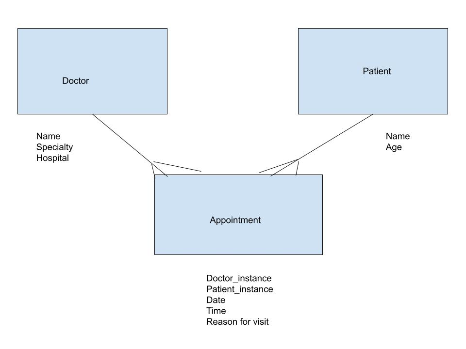

# Many to Many Relationships
---

## SWBATs:
- Review one-to-many
- Practice keeping groups of data related to classes on the class as a class variable (`@@all`)
- Practice domain modeling (ERD)
- Demonstrate Single Source of Truth by not storing collections of objects on other objects and storing objects only in one place (the class where they belong to)
- Implement both sides of a many to many relationship


## Outline

* Quick review of one-to-many:
  * Single Source of Truth Principle:
    - "Class can only store information about their own instances"
    - `@@all`: you can only have instances of the same class
    - example: if there is an instance of the person class, *only* store instances of the person class; not any additional data such as the pets or cars a person owns ❌. in order to find the pets or cars associated with the person, create a method which will search for instances of other data (cats, cars) which belong to the person 


  * What is an example of a one-to-many relationship:
    - Tweet belongs to a User, User has many Tweets;
      Tweet >- User // one-to-many 
      - when initializing Tweet, we pass a User instance as an argument;
      - One way to think about it: when a tweet is made it must have a user attached to it. But when a user is made, a tweet isn’t necessarily made.
      - I call the User the independent class and the Tweet the dependent class, since the instance of a Tweet depends on a User instance existing


  * Key to establishing a one-to-many relationship
    - connect the models through an instance
    - when initializing a Tweet, we pass a User instance as an argument
    ```ruby
    class Tweet
        def initialize(message_arg, user_arg)
            @message = message_arg
            @user = user_arg
        end
    end
    ```
  * In a one-to-many relationship, can a User have 0 Tweets?
      YES!!!!

## How to think about relationships
1. For every one (x), how many (y)? 
2. For every one (y), how many (x)?

## Many-to-Many

1. One-to-many
- User -< Tweet (User has many Tweets; Tweet belongs to a User)
- Elementary School Teacher -< Student (Elementary School Teacher has many Students; Student belongs to a Elementary School Teacher)
- Hive -< Bee (Hive has many Bees; Bee belongs to a Hive)
- Dentist -< Patient (Dentist has many Patient; Patient belongs to a Dentist)

2. Many-to-many
- High School Teacher -< Student (High School Teacher has many Students; Student has many High School Teachers)
- Movie -< Viewer (Movie has many Viewers; Viewer has many Movies)
- Movie -< Theater (Movie has many Theaters; Theater has many Movies)


---

## Practice keeping groups of data related to classes on the class as a class variable

Doctor and Patient

YAGNI: you ain't gonna need it

* How many classes do we need?
* Let's discuss the attributes
    * Doctor: hospital, specialty, name
    * Patient: name, age 
    * Appointment: doctor_instance, patient_instance, date, time, reason for visit

* Let's discuss the methods
    * What are the minimum methods we are going to need?
        - `initialize`
        - `Class.all`
        - attr_ macros
* Create `.all` method for all the classes

## Tasks (10 mins):
1. Create Patient class with: `initialize` method, `attr_` macro and `.all` method.
1. Create Doctor class with: `initialize` method, `attr_` macro and `.all` method.

## Domain modeling:


* A doctor has many patients and a patient has many doctors
* A doctor has many appointments / appointment belongs to doctor (we already know how to model this)
* A patient has many appointments / appointment belongs to patient (we already know how to model this)
* A doctor has many patients through appointments
* A patient has many doctors through appointments

## Understand single source of truth by not storing collections of objects on other objects
* How can we build relationship among these classes?
    * Using JOINER class
* Connecting all three classes using JOINER class:
    * Make sure to pass into a joiner instance the instances of the other two classes.

## Tasks (10 mins):
2. Create the JOINER class with `initialize` method, `attr_` macros and `.all` method.
3. Create `#doctors` method in the Patient class that return all the doctors who have appoinment with a particular patient (hint: you need a helper method)

## Implement both sides of a many to many relationship
* many to many => one to many + one to many
* A doctor has how many appointments!
    * `#appointments` -- all the appointments of the given doctor 
* A patient has how many appointments!
    * `#appointments` -- all the appointments of the given patient
* A doctor has a list of patients!
    * `#patients` -- all the patients of the given doctor
* A patient has a list of doctors!
    * `#doctors` -- all the doctors of the given patient