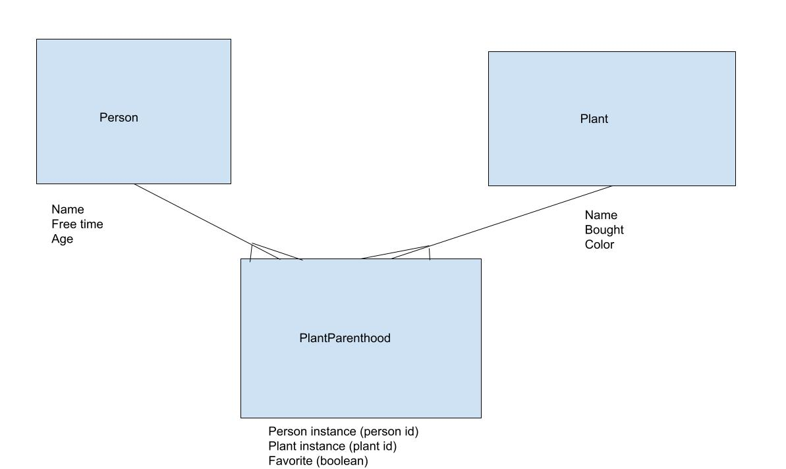

Active Record Relationships
---

## SWBATs
- [ ] Build on the knowledge of OO Ruby associations to use them in AR
- [ ] Draw an ERD prior to coding
- [ ] Design domain models thoughtfully
- [ ] Remember that it is the joiner's responsibility to know about the other's `id`s
- [ ] Become comfortable with the syntax of the association macros (`belongs_to`, `has_many`, `has_many through`) 
- [ ] Understand that macros give us methods but the associations happen in the database

### Outline
* Review what we covered so far:
    - What is Active Record?
      - ruby gem

    - What does Active Record do?
      - provides methods that allow models to interact with each other (sets up getters/setters)
      - persists data to the database
      - writes SQL for us to manipulate databases
      - bridge between ruby code and the database

    - When to use SQL and when Active Record?
      - SQL: directly talking/interacting/interfacing with the database
      - Active Record: when writing ruby code

    - What's the difference between a model and a table?
      - model: blueprint for the table (class -> instance)
      - table: container of data (different columns, rows of data)

    - Can a database have many tables?
      - yes!

    - What is meant by migration?
      - any database changes

    - Naming conventions in Ruby and Active Record
      - table name should be plural (ex. people table)
      - class name should be singular (ex. person model)

    - Project file structure
    - What is `rake`?
      - gem
      - task runner

    - What is `rake console`?
      - starts a new pry session

    - Difference between `.new` and `.create`
      - `.new`: creates a new instance BUT doesn't persist/save it to the database (need to use `.save` on the new instance to persist/save to the database)
      - `.create`: create a new instance and save it to the database

    - What is CRUD and what are the examples of methods for each letter?
      - Create: `.create`, `.new`
      - Read: `.find`, `.all`
      - Update: `.update`
      - Delete: `.destory`, `.destroy_all`

### Setting up relationships

This is our domain model:



```
Plant —————< PlantParenthood >————————— Parent
:name       :affection (int)         :name
:color      :favorite(bool)          :free_time
:bought(date)                        :age
```

- How can we associate a Person with a Plant and vice-versa?

Let's first create the association between Parent and PlantParenthood. **Since It's the PlantParenthood that has the chicken feet on itself, this is the model that should contain the instance ides of others.**

```ruby
class PlantParenthood < ActiveRecord::Base
  def people
    # Person.all.find{ |person| person.id == self.person_id }
    # OR use AR .find
    Person.find(self.person_id )
  end
end
#...
class Person < ActiveRecord::Base
  def plant_parenthoods
    # PlantParenthood.all.select{|pp| pp.person_id == self.id}
    # OR use AR .where
    PlantParenthood.where(person_id: self.id)
  end
end
```

## What About a Better Way™️

- ActiveRecord Macros
  - PlantParenthood model: `belongs_to :plant`, `belongs_to :person`
  - Plant model `has_many :plant_parenthoods`
  - Person model `has_many :people`
- These macros provide **even more** methods, like `plant_instance.person` and `person_instance.plants`
  - **Major Key🔑**––since a `plant_parenthood` instance BELONGS TO a `person` it should have ONE Person. Therefore the method is `.person`. A person HAS MANY `plant_parenthoods`, therefore the method is `.plant_parenthoods` pay attention to what is singular and what is plural.

### Important Methods from ActiveRecord

- `Model.new`
  - creates a new **RUBY** instance in local memory without persisting to the database
- `Model#save`
  - inserts or updates a **RUBY** instance to the db
- `Model.create`
  - `Model.new` + `Model#save`
  - A class method that creates a new **RUBY** instance AND saves it to the database
- `Model.all`
  - returns all instances (we wrote this by hand a million times)
- `Model.first`
  - instance with the lowest ID in the db
- `Model.find`
  - Finds a record by id and returns a Ruby instance––`Plant.find(1)` returns the plant with an id of 1
- `Model.find_by({ attribute: value })`
  - can find by one attribute-value pair or multiple
  - `Plant.find_by(name: 'Angel's prayer')` will return the plant with a name of 'Angel's prayer'

[Active Record Docs](http://edgeguides.rubyonrails.org/active_record_migrations.html#using-the-up-down-methods)
