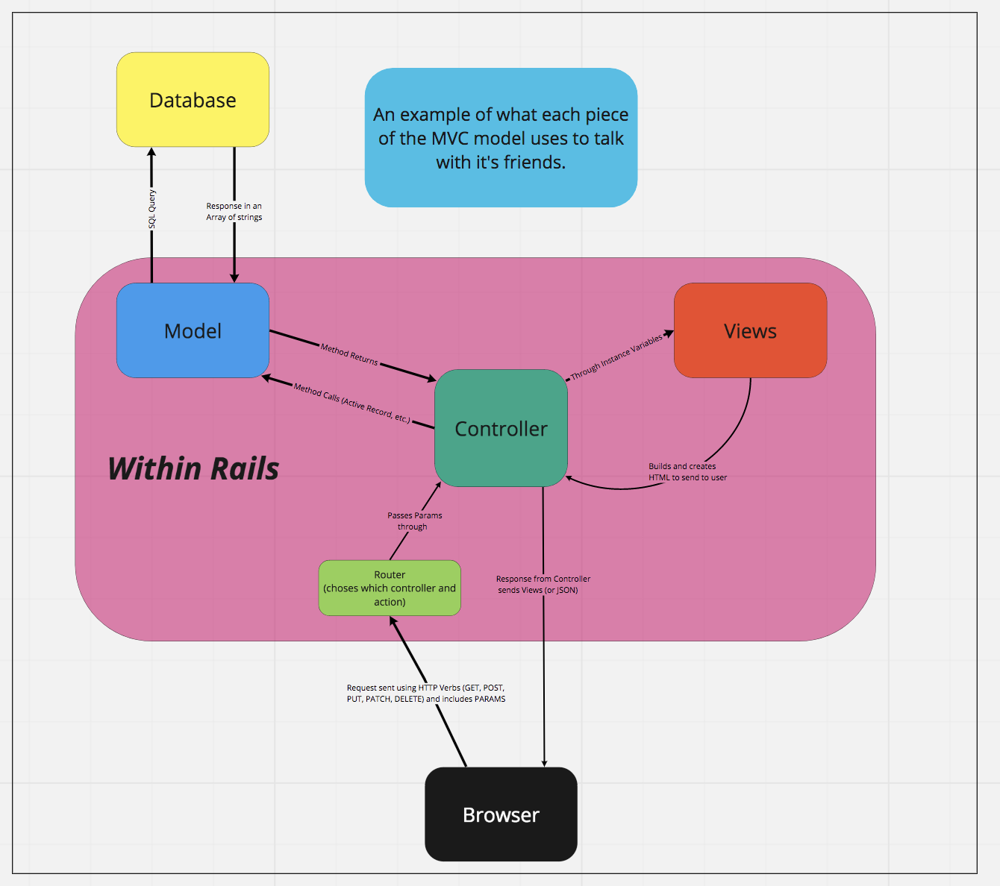

#  Intro to Rails
 
## Learning Goals
* Create a new Rails application
* Generators 
* Create routes - (similarities/differences)
* Create actions/methods for a RESTful controller
* Create views

### Outline
* [✅] Creating an app with Rails `rails new app_name`
* [✅] Generate a model
* [✅] Create controller, routes, and views
  * [✅] Make route and controller action for `index` and `show` with custom routes
  * [✅] Demonstrate implicit rendering
  * [] Refactor routes to use `resources`
* [✅] Demonstrate `link_to` helper and path helpers
  * [✅] `rails routes` and `/rails/info/routes`

### Notes
- Request/Response Cycle using Rails:
  
- ERB Tags:
  - `<% %>` <-- execute ruby code without returning the value to the html
  - `<%= %>` <-- execute ruby code and return the value to the html
  - `<%# %>` <-- erb comment syntax
- Debuggers
  - Phase 1: binding.pry
  - Phase 2: byebug
- RESTful routing
  - http://www.restular.com/

### Helpful Bookmarks
* [Rails Routing from the Outside In](https://guides.rubyonrails.org/routing.html)
* [link_to](https://apidock.com/rails/ActionView/Helpers/UrlHelper/link_to)

### Rails Commands
* `rails new <app-name>`: create a new Rails app
* `rails c`: open a console
* `rails s`: start server
* `rails routes`: display all the routes in your app, also can viewed at http://localhost:3000/rails/info/routes
* `rails g migration <migration-name> <attribute:data-type> <attribute:data-type>`: generate a migration
* `rails g model <model-name> <attribute:data-type> <attribute:data-type>`: generate a model and a migration to create the table with specified columns
* `rails db:migrate`: run all pending migrations (same as `rake db:migrate` in Phase 1)